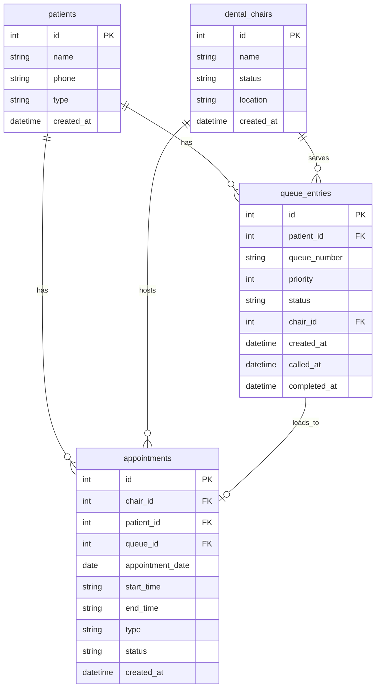

## 1. 架构设计

```mermaid
flowchart TB
    subgraph "前端层"
        "React 18 + TailwindCSS"
        "Zustand 状态管理"
        "React Router"
    end
    subgraph "后端层"
        "Express.js API"
        "排队叫号服务"
        "优先插队服务"
        "牙椅排期服务"
        "冲突校验服务"
    end
    subgraph "数据层"
        "SQLite 数据库"
    end
    "React 18 + TailwindCSS" --> "Express.js API"
    "Express.js API" --> "排队叫号服务"
    "Express.js API" --> "优先插队服务"
    "Express.js API" --> "牙椅排期服务"
    "Express.js API" --> "冲突校验服务"
    "排队叫号服务" --> "SQLite 数据库"
    "优先插队服务" --> "SQLite 数据库"
    "牙椅排期服务" --> "SQLite 数据库"
    "冲突校验服务" --> "SQLite 数据库"
```

## 2. 技术说明
- 前端：React@18 + TailwindCSS@3 + Vite
- 初始化工具：vite-init
- 后端：Express@4 + TypeScript (ESM)
- 数据库：SQLite (better-sqlite3)
- 状态管理：Zustand

## 3. 路由定义
| 路由 | 用途 |
|------|------|
| / | 首页仪表盘 - 总览排队/牙椅状态 |
| /queue | 排队叫号 - 取号、队列展示、叫号操作 |
| /priority | 优先插队 - VIP/急诊管理、优先级队列 |
| /schedule | 牙椅排期 - 牙椅状态、时段排班、新建预约 |
| /conflict | 冲突校验 - 冲突检测、退订释放、复诊预约 |

## 4. API定义

### 4.1 排队叫号 API
```typescript
interface QueueEntry {
  id: number;
  patientName: string;
  patientPhone: string;
  type: "normal" | "vip" | "emergency";
  priority: number;
  status: "waiting" | "serving" | "completed" | "cancelled";
  chairId: number | null;
  queueNumber: string;
  createdAt: string;
  calledAt: string | null;
  completedAt: string | null;
}

// POST /api/queue/take - 取号排队
// Request
interface TakeNumberRequest {
  patientName: string;
  patientPhone: string;
  type: "normal" | "vip" | "emergency";
}
// Response
interface TakeNumberResponse {
  queueNumber: string;
  position: number;
  estimatedWait: number;
}

// GET /api/queue - 获取当前队列
// GET /api/queue/serving - 获取正在就诊列表
// POST /api/queue/call-next - 叫下一位
// POST /api/queue/:id/call - 叫指定患者
// POST /api/queue/:id/complete - 完成就诊
// POST /api/queue/:id/cancel - 取消排队
```

### 4.2 优先插队 API
```typescript
// POST /api/queue/:id/promote - 提升优先级
// Request
interface PromoteRequest {
  type: "vip" | "emergency";
  targetPosition?: number;
}
// Response
interface PromoteResponse {
  newPosition: number;
  queueEntry: QueueEntry;
}

// PUT /api/queue/:id/position - 调整队列位置
// Request
interface RepositionRequest {
  newPosition: number;
}

// GET /api/queue/priority - 获取按优先级排序的队列
```

### 4.3 牙椅排期 API
```typescript
interface DentalChair {
  id: number;
  name: string;
  status: "available" | "occupied" | "maintenance";
  location: string;
}

interface Appointment {
  id: number;
  chairId: number;
  patientName: string;
  patientPhone: string;
  date: string;
  startTime: string;
  endTime: string;
  type: "normal" | "vip" | "emergency" | "followup";
  status: "scheduled" | "in_progress" | "completed" | "cancelled";
  queueId: number | null;
  createdAt: string;
}

// GET /api/chairs - 获取所有牙椅
// POST /api/chairs - 创建牙椅
// PUT /api/chairs/:id - 更新牙椅信息
// PATCH /api/chairs/:id/status - 更新牙椅状态

// GET /api/appointments?date=YYYY-MM-DD&chairId=N - 获取预约列表
// POST /api/appointments - 创建预约（自动触发冲突校验）
// PATCH /api/appointments/:id/cancel - 取消预约（释放时段）
// PATCH /api/appointments/:id/complete - 完成就诊
// POST /api/appointments/followup - 复诊预约
```

### 4.4 冲突校验 API
```typescript
interface ConflictResult {
  hasConflict: boolean;
  conflicts: ConflictDetail[];
  suggestions: TimeSlot[];
}

interface ConflictDetail {
  appointmentId: number;
  patientName: string;
  startTime: string;
  endTime: string;
}

interface TimeSlot {
  startTime: string;
  endTime: string;
  chairId: number;
  chairName: string;
}

// POST /api/conflicts/check - 冲突检测
// Request
interface CheckConflictRequest {
  chairId: number;
  date: string;
  startTime: string;
  endTime: string;
  excludeAppointmentId?: number;
}
// Response
interface CheckConflictResponse extends ConflictResult {}

// GET /api/conflicts/suggestions?chairId=N&date=YYYY-MM-DD&duration=30 - 推荐可用时段
```

## 5. 服务器架构图

```mermaid
flowchart LR
    subgraph "Controller层"
        "QueueController"
        "ChairController"
        "AppointmentController"
        "ConflictController"
    end
    subgraph "Service层"
        "QueueService"
        "ChairService"
        "AppointmentService"
        "ConflictService"
    end
    subgraph "Repository层"
        "QueueRepository"
        "ChairRepository"
        "AppointmentRepository"
    end
    subgraph "数据层"
        "SQLite"
    end
    "QueueController" --> "QueueService"
    "ChairController" --> "ChairService"
    "AppointmentController" --> "AppointmentService"
    "ConflictController" --> "ConflictService"
    "QueueService" --> "QueueRepository"
    "ChairService" --> "ChairRepository"
    "AppointmentService" --> "AppointmentRepository"
    "ConflictService" --> "AppointmentRepository"
    "ConflictService" --> "ChairRepository"
    "QueueRepository" --> "SQLite"
    "ChairRepository" --> "SQLite"
    "AppointmentRepository" --> "SQLite"
```

## 6. 数据模型

### 6.1 数据模型定义



### 6.2 数据定义语言

```sql
CREATE TABLE patients (
  id INTEGER PRIMARY KEY AUTOINCREMENT,
  name TEXT NOT NULL,
  phone TEXT NOT NULL,
  type TEXT NOT NULL DEFAULT 'normal' CHECK(type IN ('normal', 'vip', 'emergency')),
  created_at TEXT NOT NULL DEFAULT (datetime('now'))
);

CREATE TABLE dental_chairs (
  id INTEGER PRIMARY KEY AUTOINCREMENT,
  name TEXT NOT NULL UNIQUE,
  status TEXT NOT NULL DEFAULT 'available' CHECK(status IN ('available', 'occupied', 'maintenance')),
  location TEXT NOT NULL DEFAULT '',
  created_at TEXT NOT NULL DEFAULT (datetime('now'))
);

CREATE TABLE queue_entries (
  id INTEGER PRIMARY KEY AUTOINCREMENT,
  patient_id INTEGER NOT NULL REFERENCES patients(id),
  queue_number TEXT NOT NULL UNIQUE,
  priority INTEGER NOT NULL DEFAULT 0,
  status TEXT NOT NULL DEFAULT 'waiting' CHECK(status IN ('waiting', 'serving', 'completed', 'cancelled')),
  chair_id INTEGER REFERENCES dental_chairs(id),
  created_at TEXT NOT NULL DEFAULT (datetime('now')),
  called_at TEXT,
  completed_at TEXT
);

CREATE INDEX idx_queue_status ON queue_entries(status);
CREATE INDEX idx_queue_priority ON queue_entries(priority DESC, created_at ASC);

CREATE TABLE appointments (
  id INTEGER PRIMARY KEY AUTOINCREMENT,
  chair_id INTEGER NOT NULL REFERENCES dental_chairs(id),
  patient_id INTEGER NOT NULL REFERENCES patients(id),
  queue_id INTEGER REFERENCES queue_entries(id),
  appointment_date TEXT NOT NULL,
  start_time TEXT NOT NULL,
  end_time TEXT NOT NULL,
  type TEXT NOT NULL DEFAULT 'normal' CHECK(type IN ('normal', 'vip', 'emergency', 'followup')),
  status TEXT NOT NULL DEFAULT 'scheduled' CHECK(status IN ('scheduled', 'in_progress', 'completed', 'cancelled')),
  created_at TEXT NOT NULL DEFAULT (datetime('now'))
);

CREATE INDEX idx_appointments_chair_date ON appointments(chair_id, appointment_date);
CREATE INDEX idx_appointments_status ON appointments(status);

-- 初始牙椅数据
INSERT INTO dental_chairs (name, status, location) VALUES 
  ('1号椅', 'available', 'A区'),
  ('2号椅', 'available', 'A区'),
  ('3号椅', 'available', 'B区'),
  ('4号椅', 'available', 'B区'),
  ('5号椅', 'available', 'C区');
```
